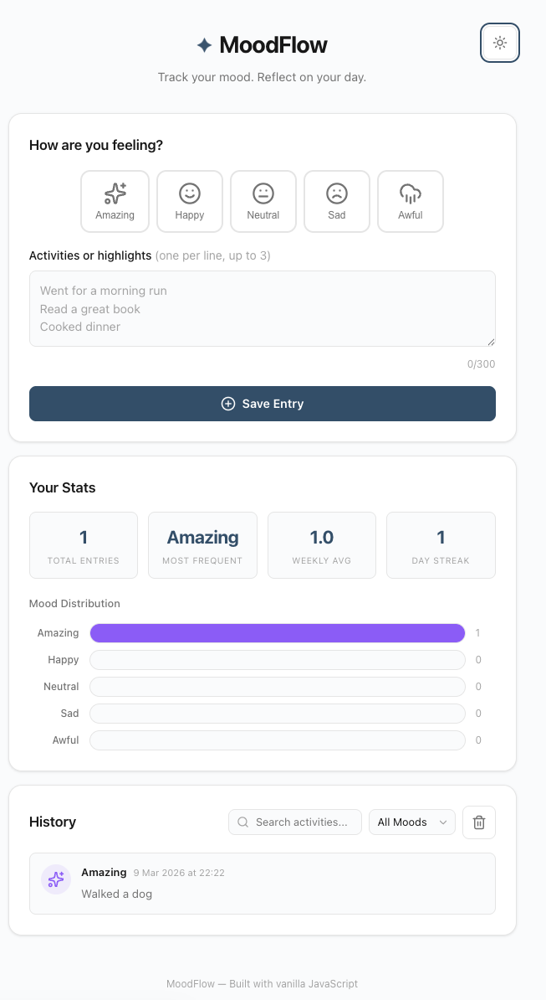
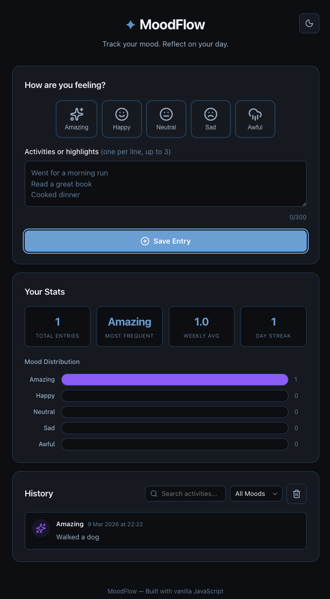

# MoodFlow — Mood & Activity Tracker

A single-page mood and activity tracker built with vanilla HTML, CSS, and JavaScript for the Web Applications with JavaScript course at Laurea UAS.

**Live Demo:** https://mikeldn1995.github.io/laurea/Project1-Mood-Tracker/
**Repository:** https://github.com/mikeldn1995/laurea/tree/main/Project1-Mood-Tracker

---

## Features

- Select from five moods (Amazing, Happy, Neutral, Sad, Awful) with Lucide icons
- Log up to three daily activities or highlights
- All entries persist in `localStorage` across page refreshes
- Browse history with date and time stamps
- Filter entries by mood using a dropdown
- Search entries by keyword in real time
- Delete individual entries with animation
- Clear all entries with a confirmation prompt
- Stats dashboard: total entries, most frequent mood, weekly count, day streak
- Mood distribution bar chart
- Dark mode with system preference auto-detection and manual override
- Fully responsive for mobile and desktop
- Keyboard accessible with ARIA labels and semantic HTML
- User input sanitised to prevent XSS

## How to Run

### Windows

1. Clone or download the repository
2. Open the `Project1-Mood-Tracker` folder in VS Code
3. Install the Live Server extension
4. Right-click `index.html` → Open with Live Server
5. Opens at `http://127.0.0.1:5500/`

### macOS

1. Clone or download the repository
2. Open Terminal and navigate to the folder:
   ```
   cd path/to/Project1-Mood-Tracker
   ```
3. Start a local server:
   ```
   python3 -m http.server 5500
   ```
4. Open `http://localhost:5500/` in your browser

## Architecture

Three files with clear separation of concerns:

- `index.html` — semantic structure with ARIA attributes and Lucide icon CDN
- `style.css` — CSS custom properties for theming, responsive layout, dark mode via `.dark` class
- `script.js` — vanilla JavaScript, modular functions, no frameworks

**Data flow:** user input → validation → sanitisation → localStorage → DOM render

**Limitations:**
- Local storage only, no server sync or cloud backup
- No data export/import
- Stats are simple calculations without a charting library

## Screenshots




## Reflection

Building MoodFlow taught me a lot about what vanilla JavaScript can do without any frameworks. The hardest part was keeping the render cycle consistent — every user action (adding, deleting, filtering, searching) needs to update both the entry list and the statistics at the same time, and getting that right without creating stale state took careful thought.

I spent quite a bit of time on localStorage handling. At first I just parsed and used the data directly, but then I realised that corrupted or unexpected data could break the whole app. Adding try-catch blocks and validating the shape of each entry before using it made things much more solid. That was probably my biggest learning moment — thinking about what happens when data is not what you expect.

Accessibility was another area where I learned by doing. I added ARIA labels and keyboard support, then actually tested by tabbing through the whole app. I found issues I never would have spotted just by clicking around — for example, the delete button was invisible to keyboard users until I added a focus-within rule.

Dark mode was fun to implement. Using `matchMedia` to detect the system preference and then letting the user override it with a toggle that saves to localStorage felt like a clean pattern I can reuse.

If I continue this project, I would add a calendar heatmap to show mood patterns over weeks, and an export button so users can download their data as JSON.

## Self-Assessment

| Criterion | Score | Evidence |
|-----------|-------|----------|
| A. Core Functionality | 10/10 | Full mood → save → history → filter → delete → stats flow, error handling, persistence |
| B. Code Quality | 5/5 | Small focused functions, semantic HTML, consistent formatting, try-catch, sanitisation |
| C. UX & Accessibility | 5/5 | Responsive layout, keyboard nav, ARIA labels, focus management, dark mode, animations |
| D. Data Handling | 4/4 | Safe localStorage with shape validation, XSS sanitisation, try-catch fallbacks |
| E. Documentation | 3/3 | README with features, run steps, architecture, reflection, self-assessment, timestamps |
| F. Deployment | 3/3 | Live GitHub Pages URL, consistent repo links |
| G. Demo Video | 5/5 | Structured 3-5 min demo with code highlight and reflection |

## Video

[Watch the demo video (OneDrive)](https://laureauas-my.sharepoint.com/:v:/g/personal/mik00504_laurea_fi/IQAyYg8sBrZzTaZ9rOxDFoixAfM4Ws2DZ4lyhDqMMrvkNNI?nav=eyJyZWZlcnJhbEluZm8iOnsicmVmZXJyYWxBcHAiOiJPbmVEcml2ZUZvckJ1c2luZXNzIiwicmVmZXJyYWxBcHBQbGF0Zm9ybSI6IldlYiIsInJlZmVycmFsTW9kZSI6InZpZXciLCJyZWZlcnJhbFZpZXciOiJNeUZpbGVzTGlua0NvcHkifX0&e=12ry7z)

### Timestamps

| Time | Section |
|------|---------|
| 0:00 | Introduction |
| 0:14 | Overview |
| 0:30 | Key features |
| 1:11 | Demonstration |
| 2:30 | Script and code walkthrough |
| 3:35 | Reflection |
| 4:28 | End |
