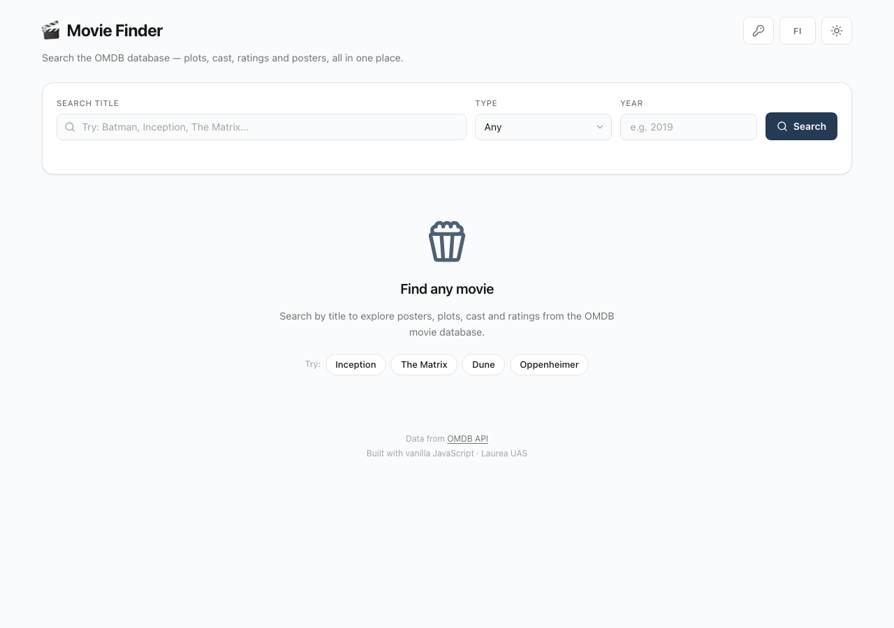
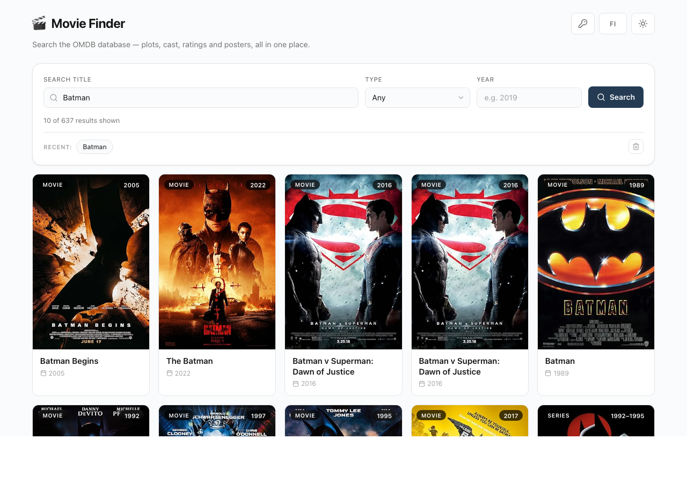
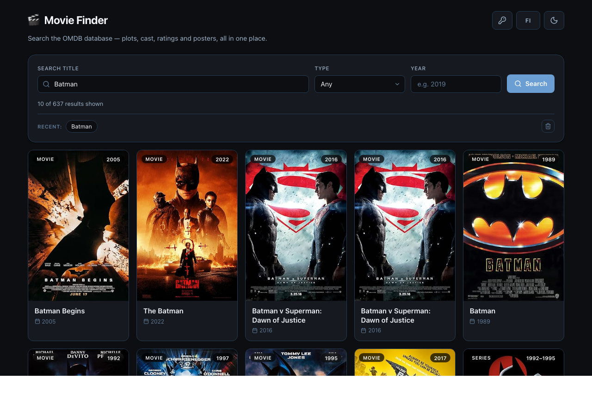
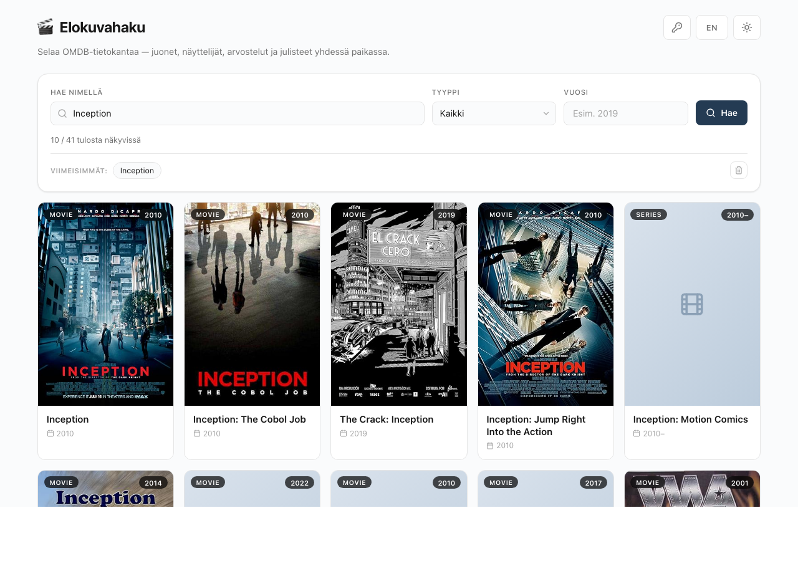
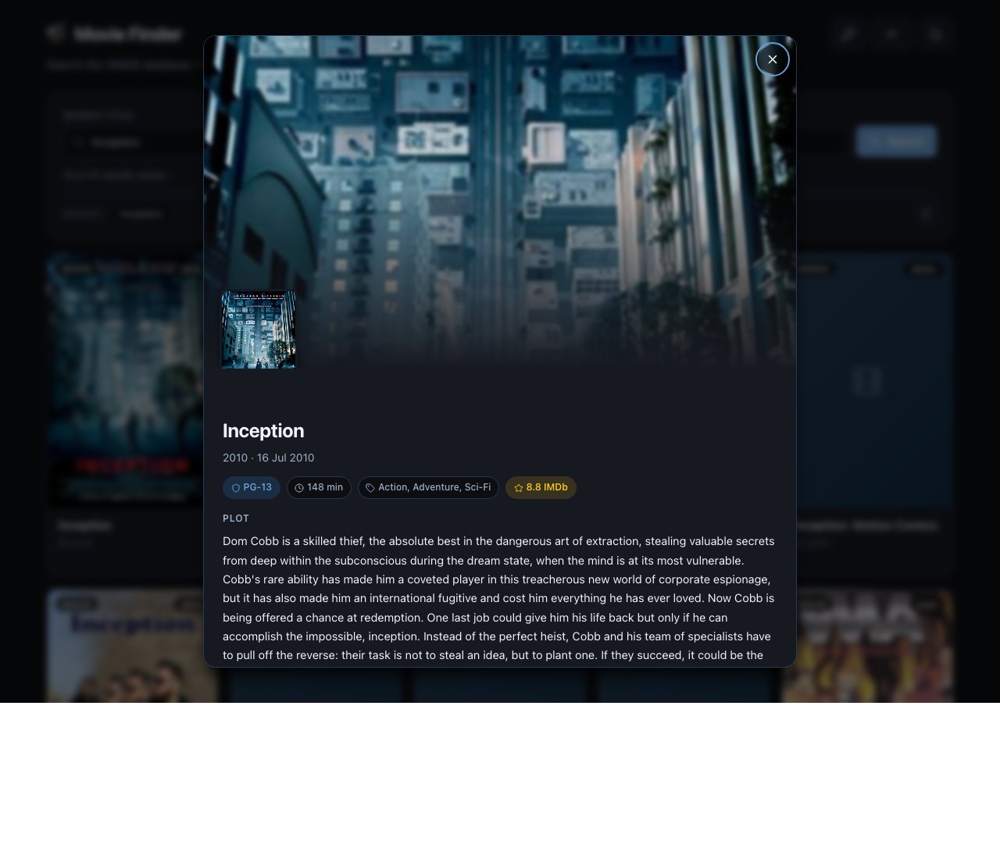
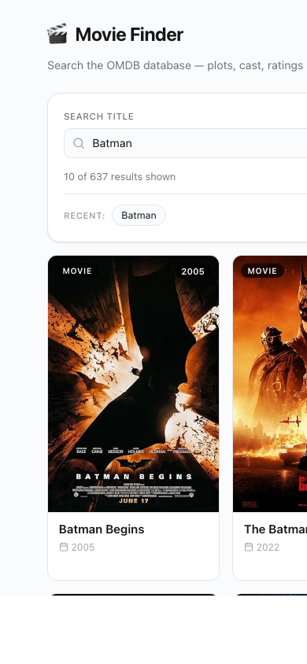

# Movie Finder — OMDB Search

A single-page AJAX application that searches the [OMDB movie database](https://www.omdbapi.com/) over the Fetch API, renders results with dynamic DOM templating, and ships a fully bilingual (English / Finnish) interface with dark mode. Built for the *Web Applications with JavaScript* course at Laurea UAS (Project 2 — The Live Data Explorer).

**Live Demo:** https://mikeldn1995.github.io/laurea/Project2-Movie-Finder/
**Repository:** https://github.com/mikeldn1995/laurea/tree/main/Project2-Movie-Finder

---

## Features

- Live data from OMDB over `fetch()` + `async/await` + JSON parsing
- Full-text title search with optional **type** (movie / series / episode) and **year** filters
- **Load more** pagination — OMDB returns 10 results per page, the app keeps appending
- Rich detail modal: hero backdrop, poster inset, plot, cast, director, writer, country, language, awards, box office, and aggregated ratings (IMDb / Rotten Tomatoes / Metacritic)
- **Bilingual UI** (English / Finnish) with a live language toggle, preference saved to `localStorage`
- **Dark mode** with system preference auto-detection and manual override
- **Recent searches** persisted locally, one-click to re-run, clear button included
- **API key setup dialog** — the key lives in `localStorage` only, never committed to the repo
- Quick-suggestion pills on the welcome screen (Inception, The Matrix, Dune, Oppenheimer)
- Responsive CSS grid (auto-fit posters) from desktop down to 390 px phones
- Loading spinner, empty state, and friendly error screen with retry button
- Accessible: semantic HTML, ARIA labels, `aria-live` regions, keyboard Escape to close modals, visible focus ring, focus restoration, `prefers-reduced-motion` support
- XSS-safe: every dynamic string is HTML-escaped before insertion
- Zero dependencies, zero build step — just HTML, CSS and JavaScript

## How to Run

### Windows

1. Clone or download the repository
2. Open the `Project2-Movie-Finder` folder in VS Code
3. Install the *Live Server* extension
4. Right-click `index.html` → **Open with Live Server**
5. Opens at `http://127.0.0.1:5500/`
6. Click the key icon in the top-right and paste a free OMDB API key from [omdbapi.com](https://www.omdbapi.com/apikey.aspx) — or leave it blank to use the built-in demo key

### macOS

1. Clone or download the repository
2. Open Terminal and navigate to the folder:
   ```
   cd path/to/Project2-Movie-Finder
   ```
3. Start a local server:
   ```
   python3 -m http.server 5500
   ```
4. Open `http://localhost:5500/` in your browser

> **Note on API keys:** OMDB requires a free per-user key. The app ships with a widely-used public demo key so the deployed URL works for reviewers, but for heavy use you should request your own at [omdbapi.com/apikey.aspx](https://www.omdbapi.com/apikey.aspx). Your key is saved in `localStorage` only — the repo's `.gitignore` excludes any `config.local.js` or `.env` files so credentials cannot be committed by accident.

## Architecture

Three files with a clean separation of concerns — no frameworks, no bundler:

- `index.html` — semantic HTML5 with ARIA roles, a search form, a detail modal and a settings modal
- `style.css` — CSS custom properties for theming, responsive grid/flex layout, dark-mode via `.dark` class, reduced-motion support
- `script.js` — vanilla JavaScript organised into labelled sections:
  - `translations` — English / Finnish i18n dictionary (with parameterised messages like result counts)
  - `state` — single source of truth (query, filters, results, recents, cache)
  - `storage` — thin `try/catch` wrapper around `localStorage`
  - `omdbFetch()` — generic OMDB caller used for both search and detail endpoints
  - Rendering: `renderResults()`, `cardHTML()`, `movieDetailHTML()`, `factHTML()`
  - Event flow: form submit, load-more, suggestion chips, recent chips, language toggle, theme toggle
  - `init()` orchestrates prefs loading, event wiring and initial render

**Data flow:** user submits → `omdbFetch()` → JSON → state updates → `renderResults()` paints template-literal cards → click card → `fetchMovieById()` (cached) → `movieDetailHTML()` renders modal.

**Error handling:** every fetch is wrapped in `try/catch`. OMDB's `{Response: "False", Error: "..."}` payload is converted into a thrown error with an `.omdbError` property, then matched against "invalid key", "daily limit" and "not found" cases so the UI can show the right localised message. Network failures show a generic retry screen.

**Limitations:**
- OMDB's search is title-only and returns a maximum of 10 results per page — the "Load more" pattern works around that
- Descriptions and metadata are English-only from OMDB; the UI chrome translates but the movie content doesn't
- The demo API key has a shared daily quota — in normal coursework use this is a non-issue, but heavy testing may hit the limit

## Screenshots








## Reflection

Project 2 pushed me deeper into asynchronous JavaScript than anything I'd done before. The biggest mental shift from Project 1 was moving from *"I own the data"* (localStorage) to *"I have to ask a server for it and handle everything that can go wrong along the way."* Writing the fetch layer with `async/await` inside `try/catch` forced me to think clearly about the three states every request has — loading, success and failure — and to design visible UI for each one instead of letting the app silently break.

OMDB's error model was an interesting lesson. A successful HTTP request can still be a logical error — the body arrives with `Response: "False"` and a message like "Movie not found!" or "Invalid API key!". My first pass treated any `200 OK` as success and just crashed when `data.Search` was missing. I moved that check into a single helper, `omdbFetch()`, which throws when the API reports failure. Then `runSearch()` catches the error and routes it to the right localised message using regex matching on `err.omdbError`. That refactor removed a bunch of duplicated checks from the call sites and is probably the cleanest thing in the codebase.

Internationalisation was new territory. I built a `translations` dictionary keyed by language code and a pair of `data-i18n` / `data-i18n-attr` attributes so the HTML could declare its own strings. One subtlety I didn't expect: toggling to Finnish also has to re-render the result count ("10 / 637 tulosta näkyvissä") because it's computed at render-time, not stored in the DOM. I fixed that by calling the render update from inside `applyLang()`.

One bug I fixed along the way: when the settings modal was initially hidden with the `hidden` attribute, it kept showing because the `.modal { display: flex }` rule outranked the attribute's default. Adding `[hidden] { display: none !important; }` to the stylesheet fixed it globally and made me more aware of how CSS display modes interact with HTML5 semantics.

If I continued the project I'd add a favourites list (persisted to localStorage), a trailer embed inside the detail modal, and keyboard arrow-key navigation between result cards.

## Self-Assessment

| Criterion | Score | Evidence |
|-----------|-------|----------|
| A. Core Functionality | 10/10 | Working search, filters (type/year), pagination, rich detail modal, recent searches, retry on error |
| B. Code Quality | 5/5 | Clear section headers, small focused functions, `try/catch`, defensive null checks, no duplication |
| C. UX & Accessibility | 5/5 | Responsive grid, ARIA roles/labels, focus restoration, `aria-live` status, Escape to close modal, reduced-motion support |
| D. Data Handling | 4/4 | HTML escaping on every dynamic string, safe `localStorage` with try/catch, detail cache, graceful fallbacks for `N/A` values |
| E. Documentation | 3/3 | Features, run steps for Win/macOS, architecture, limitations, reflection, self-assessment table |
| F. Deployment | 3/3 | Live GitHub Pages URL, consistent repo links, `.gitignore` in root |
| G. Demo Video | 0/5 | Not included in this submission |
| **Total** | **30/35** | |
